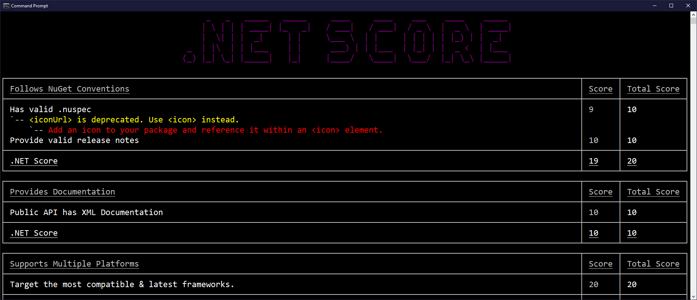

# score
A tool that scores your NuGet packages & gives you suggestions to improve them.

**_This tool is under active development & results should be taken with a grain of salt._**

## Installation
```
> dotnet tool install --global score
```

## Usage
*Examine a specific package.*
```
> USAGE:
    score <PACKAGE_NAME> <VERSION> [OPTIONS]

EXAMPLES:
    score <PACKAGE_NAME> <VERSION>

ARGUMENTS:
    <PACKAGE_NAME>    The package name to score
    <VERSION>         The version of the package to score

OPTIONS:
    -h, --help    Prints help information
```

## Example
```
score Autofac 6.1.0
```



## Why
Scores are created based on the following categories([heavily inspired by pana](https://pub.dev/packages/pana)):

- [Following NuGet Conventions](#following-nuget-conventions)
- [Providing Documentation](#providing-documentation)
- [Supporting Multiple Platforms](#supporting-multiple-platforms)
- [Passing Static Analysis](#passing-static-analysis)
- [Supporting Up-To-Date Dependencies](#supporting-up-to-date-dependencies)

## Following NuGet Conventions
NuGet packages are expected to follow certain file layouts when organizing a package. Most importantly make sure you:

- Provide a valid .nuspec or project properties. Ensure all Urls are valid and use https.
- Provide a valid LICENSE. Preferably a permissive open source license.
- Provide a README.md. (Upcoming)
- Provide a RELEASENOTES/CHANGELOG.md (Upcoming)

## Providing Documentation
Packages can include documentation in two main areas:

1. Including an example inside your package. (TODO)
2. At least 20% of the public API members containing [API documentation](https://docs.microsoft.com/dotnet/csharp/codedoc).

## Supporting Multiple Platforms
Packages are encouraged to support multiple platforms to allow developers to support a wide variety of platforms. [.NET supports many platforms](https://dotnet.microsoft.com/learn/dotnet/what-is-dotnet). 

score checks for two portable frameworks to ensure packages are both compatible and provide the latest functionality:

- **.NET Standard 2.0:** The most compatible framework that supports majority of platforms.
- **.NET 5:** The latest framework that allows you to leverage the newest platform features.

For more information on .NET 5 and .NET Standard, see the [following docs](https://docs.microsoft.com/dotnet/standard/net-standard#when-to-target-net50-vs-netstandard).

## Passing Static Analysis
Packages go through a static analysis tool to determine if the package has any major health or security issues. These checks help ensure you are using the latest tooling to secure your software supply chain such as reproducible builds, compiler flags, and much more. (TODO)

**This section is not implemented.**

## Supporting Up-To-Date Dependencies
Packages will be checked to ensure their dependencies are the latest version. 

Additionally they will be scanned for any known vulnerabilities or deprecated packages in those dependencies and warn you if you should take on a later version or suggested alternative. (TODO)

Wonderful tools already exist that do some of this such as [dotnet-outdated](https://github.com/dotnet-outdated/dotnet-outdated) which will check outdated dependencies. [snitch](https://github.com/spectresystems/snitch) which will check to see if you can remove unneeded transitive packages. 

## Best Practices
This tool does it's best job to provide many of the best practices of authoring NuGet packages. There are many best practices that do not exist in this tool today & will be considered in a future release. Please create a [new issue](https://github.com/JonDouglas/score/issues) with your favorite best practice if one is missing here!

- [Open Source Library Guidance](https://docs.microsoft.com/en-us/dotnet/standard/library-guidance/)
- [NuGet Library Guidance](https://docs.microsoft.com/en-us/dotnet/standard/library-guidance/nuget)
- [Package Authoring Best Practices](https://docs.microsoft.com/nuget/create-packages/package-authoring-best-practices)

## Contribute!
Please feel free to test this tool against any package & report any [issues](https://github.com/JonDouglas/score/issues)! This tool is a **proof of concept** & likely doesn't support every case. It's goal is to work against NuGet package `Dependency` types, but NuGet hosts more than just dependencies, so you can also try running this tool against `Template` and `DotNetTool` packages as well to see what happens! If you'd like to support these cases more, open up a issue or PR! 

**Any compelling package best practice check will be considered & PRs are gladly accepted!**


